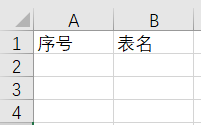
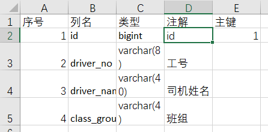
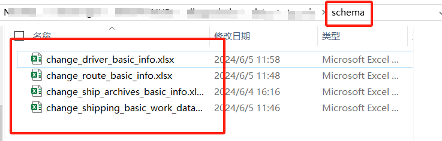
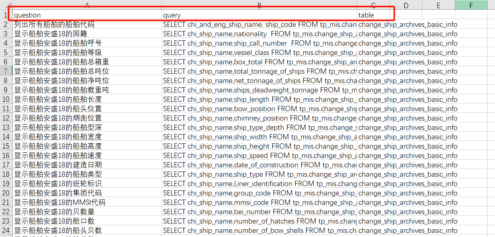

# 训练数据准备

## 1、所有表名

all_tables.xlsx：列出所有表（先不包含有时间戳的表，下面所有数据同理）

## 2、schema

每张表的schema文件——excel文件，格式如下：

上述所有表的schma文件，整合到一个名为”schema“的文件夹中：

## 2、查询-sql文本对

用于训练的查询和sql数据，放在excel文件中，格式如下：

question列代表查询，这个数据集覆盖的场景（字眼）越全面越好。

