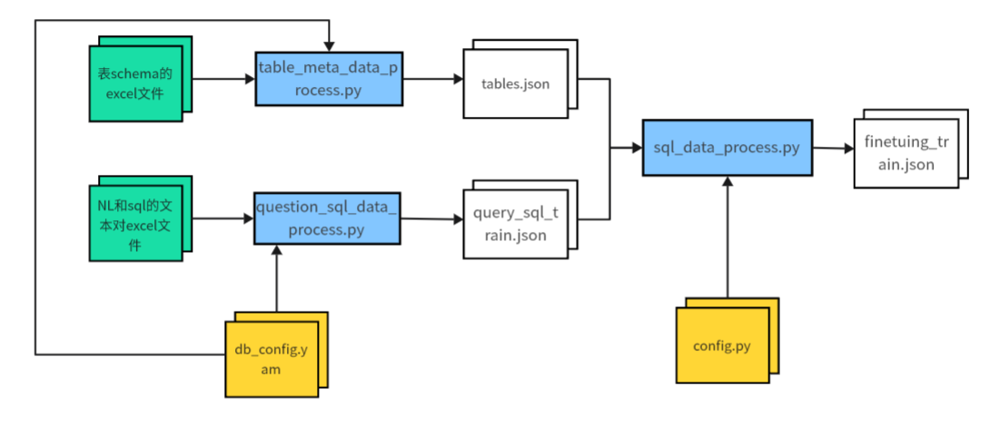

# Neuvix-NL2SQL项目

本项目基于DB-GBT-HUB框架，将重构数据预处理、模型微调两部分功能。

#### 目前已重构文件夹：

| 文件夹名称   | 路径                   | 说明                                                         |
| ------------ | ---------------------- | ------------------------------------------------------------ |
| config       | dbgpt_hub\configs      | 保存配置参数的路径，例如data_source数据来源                  |
| data_process | dbgpt_hub\data_process | 数据预处理，包括将schema转化为tables.json, 将sql、查询对转化为finetuing_train.json微调数据 |
| dataset_util | dbgpt_hub\dataset_util | 数据预处理的工具包，负责解析excel文件表，或者连接mysql db（目前不适用）。里面有很重要的db_config.yaml配置文件，指定数据库和相应的表。 |

#### 模型底座

llama3——支持中文


## 1 数据预处理

整体流程图：



#### 1.1 将schema转成tables.json

tables.json是存储表元数据的文件，用于构造prompt

- schema路径：dbgpt_hub\data\tp_mis\schema：一个表对应一个excel文件。文件格式严格按照现有文件的格式。

- tables.json路径：dbgpt_hub\data\tp_mis\tables.json

- tables.json生成方法：

  1）配置好dbgpt_hub\dataset_util\db_config.yaml文件的数据库、表信息。详情看文件中注释。

  2）将schema的excel文件放入上述schema路径。

  3）运行dbgpt_hub\data_process\table_meta_data_process.py脚本。

- tables.json格式：

  - ```json
    [
     {
      "column_comments": [[字段注释]],
      "column_names_original":[[字段名称]],
      "column_types": [字段类型],
      "db_id": "数据库名称",
      "foreign_keys": [],
      "primary_keys": [所有主键],
      "table_names": [],
      "table_names_original": [所有表]
     }
    ]
    ```

#### 1.2 准备question_sql.json

这是用于构造prompt进行训练的，查询和sql数据对，最终格式如下：

```json
{
        "question": "查询所有等待进港船的船名",
        "query": "SELECT vssc_name FROM change_shipping_basic_work_data WHERE ship_state=\"预进\"",
        "table": "change_shipping_basic_work_data",
        "db_id": "tp_mis"
    }
```

为了生成这个文件，我添加了脚本dbgpt_hub\data_process\question_sql_data_process.py，运行步骤如下：

- 准备好预先收集的NL和SQL数据，放到以下路径：dbgpt_hub\data\tp_mis\query_sql.xlsx

- 配置好db_config.yaml的database：

  ```yaml
  database:
    db: tp_mis  # 数据库名
    db_schema: schema  # schema所在目录名
    question_sql_pairs: ["question_sql.xlsx", "question_sql.json"] # 输入、输出的查询、sql文本对文件名称
  ```

- 运行dbgpt_hub\data_process\question_sql_data_process.py脚本

- 得到dbgpt_hub\data\tp_mis\query_sql.json

#### 1.3 将tables.json和query_sql.json转换为prompt_train.json文件

prompt文件是：dbgpt_hub\data\tp_mis\prompt_train.json

这个文件就是微调工程的输入数据（即给模型的提示词），格式如下：

```json
[
    {
        "db_id": "tp_mis",
        "table": "change_ship_archives_basic_info",
        "instruction": "I want you to act as a SQL terminal in front of an example database, you need only to return the sql command to me.Below is an instruction that describes a task, Write a response that appropriately completes the request.\n\"\n##Instruction:\ntp_mis contains tables such as change_ship_archives_basic_info. Table change_ship_archives_basic_info has columns such as id, ship_code, chi_and_eng_ship_name, nationality, ship_call_number, ship_imo_number, vessel_class, box_total, total_tonnage_of_ships, net_tonnage_of_ships, ships_deadweight_tonnage, ship_length, bow_position, chimney_position, ship_type_depth, ship_width, ship_height, ship_speed, date_of_construction, ship_type, Liner_identification, group_code, mmsi_code, bei_number, number_of_hatches, number_of_bow_shells, number_of_hatch_covers, empty_draft_tonnage, Heavy_load_draft_tonnage, number_of_deck_starting_layer, beihao_arrangement_order, slot_way, stowage_scheme, belonging_to_the_dock, create_date_time, del_flag, chi_ship_name, eng_ship_name. The comments of columns are 主键ID, 船舶代码, 中英文船名, 国籍, 船舶呼号, 船舶IMO号, 船舶等级？, 总箱量, 船舶总吨位, 船舶净吨位, 船舶载重吨, 船舶长度, 船头位置, 烟囱位置, 船舶型深, 船舶宽度, 船舶高度, 船舶速度, 建造日期, 船舶类型, 班轮标识, 集团代码, MMSI代码, 贝数量, 舱口数, 船头贝数, 舱盖数, 空载吃水吨位, 重载吃水吨位, 甲板起始层序号, 贝号排列顺序, slot_way?, stowage_scheme?, 所属码头, 记录创建时间, 删除标记。0-未删除；1-已删除, 中文船名, 英文船名. id is the primary key.\n\n",
        "input": "###Input:\n列出所有船舶的船舶代码\n\n###Response:",
        "output": "SELECT chi_and_eng_ship_name, ship_code FROM tp_mis.change_ship_archives_basic_info;",
        "history": []
    },
]
```

会包含数据库所有表的字段信息、输入的查询NL和sql。

- prompt_train.json生成步骤：

  1. 确保以下几个文件正确：dbgpt_hub\configs\config.py（其中的SQL_DATA_INFO配置），data数据库目录下query_sql.json存在，dbgpt_hub\data\tp_mis\tables.json存在。

     ```python
     SQL_DATA_INFO = [
         {
             "data_source": "tp_mis",  # 这是一个库
             "train_file": ["question_sql.json"], # 用于生成prompt训练集的初始数据集，可以加多个训练数据集, "train_others.json"
             "dev_file": ["dev.json"],
             "train_tables_file": "tables.json",
             "dev_tables_file": "tables.json",
             "db_id_name": "db_id",
             "output_name": "query",
             "is_multiple_turn": False,
         }
     ]
     ```

     

  2. 运行dbgpt_hub\data_process\sql_data_process.py脚本

  3. 生成文件dbgpt_hub\data\tp_mis\prompt_train.json。


## 2 模型微调

