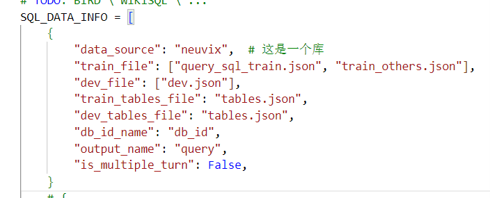

# Neuvix-NL2SQL项目

本项目基于DB-GBT-HUB框架，将重构数据预处理、模型微调两部分功能。

#### 目前已重构文件夹：

| 文件夹名称   | 路径                   | 说明                                                         |
| ------------ | ---------------------- | ------------------------------------------------------------ |
| config       | dbgpt_hub\configs      | 保存配置参数的路径，例如data_source数据来源                  |
| data_process | dbgpt_hub\data_process | 数据预处理，包括将schema转化为tables.json, 将sql、查询对转化为finetuing_train.json微调数据 |
| dataset_util | dbgpt_hub\dataset_util | 数据预处理的工具包，负责解析excel文件表，或者连接mysql db（目前不适用）。里面有很重要的db_config.yaml配置文件，指定数据库和相应的表。 |

#### 模型底座

llama3——支持中文


## 1 数据预处理

整体流程图：


#### 1.1 将schema转成tables.json

tables.json是存储表元数据的文件，用于构造prompt

- schema路径：dbgpt_hub\data\neuvix\schema：一个表对应一个excel文件。文件格式严格按照现有文件的格式。

- tables.json路径：dbgpt_hub\data\neuvix\tables.json

- tables.json生成方法：

  1）配置好dbgpt_hub\dataset_util\db_config.yaml文件的数据库、表信息。详情看文件中注释。

  2）将schema的excel文件放入上述schema路径。

  3）运行dbgpt_hub\data_process\table_meta_data_process.py脚本。

- tables.json格式：

  - ```json
    [
     {
      "column_comments": [[字段注释]],
      "column_names_original":[[字段名称]],
      "column_types": [字段类型],
      "db_id": "数据库名称",
      "foreign_keys": [],
      "primary_keys": [所有主键],
      "table_names": [],
      "table_names_original": [所有表]
     }
    ]
    ```

#### 1.2 准备query_sql_train.json

这是用于微调的NL和sql数据对，格式如下：

```json
{
        "question": "列出所有船舶的船舶代码",
        "query": "SELECT chi_and_eng_ship_name, ship_code FROM tp_mis.change_ship_archives_basic_info;",
        "db_id": "neuvix"
 }
```

为了生成这个文件，我添加了脚本dbgpt_hub\data_process\question_sql_data_process.py，运行步骤如下：

- 准备好预先收集的NL和SQL数据，放到以下路径：dbgpt_hub\data\neuvix\query_sql.xlsx
- 配置好db_config.yaml的database-db
- 运行dbgpt_hub\data_process\question_sql_data_process.py脚本
- 得到dbgpt_hub\data\neuvix\query_sql_train.json

#### 1.3 将tables.json和query_sql_train.json转换为prompt文件

prompt文件是：dbgpt_hub\data\neuvix\finetuing_train.json

这个文件就是微调工程的输入数据（即给模型的提示词），格式如下：

```json
[
    {
        "db_id": "department_management",
        "instruction": "I want you to act as a SQL terminal in front of an example database, you need only to return the sql command to me.Below is an instruction that describes a task, Write a response that appropriately completes the request.\n\"\n##Instruction:\ndepartment_management contains tables such as department, head, management. Table department has columns such as Department_ID, Name, Creation, Ranking, Budget_in_Billions, Num_Employees. Department_ID is the primary key.\nTable head has columns such as head_ID, name, born_state, age. head_ID is the primary key.\nTable management has columns such as department_ID, head_ID, temporary_acting. department_ID is the primary key.\nThe head_ID of management is the foreign key of head_ID of head.\nThe department_ID of management is the foreign key of Department_ID of department.\n\n",
        "input": "###Input:\nHow many heads of the departments are older than 56 ?\n\n###Response:",
        "output": "SELECT count(*) FROM head WHERE age  >  56",
        "history": []
    }
]
```

会包含数据库所有表的字段信息、输入的查询NL和sql。

- finetuing_train.json生成步骤：

  1. 确保以下几个文件正确：dbgpt_hub\configs\config.py（其中的SQL_DATA_INFO配置），data数据库目录下query_sql_train.json存在，dbgpt_hub\data\neuvix\tables.json存在。

     

  2. 运行dbgpt_hub\data_process\sql_data_process.py脚本

  3. 生成文件dbgpt_hub\data\neuvix\finetuing_train.json。


## 2 模型微调

