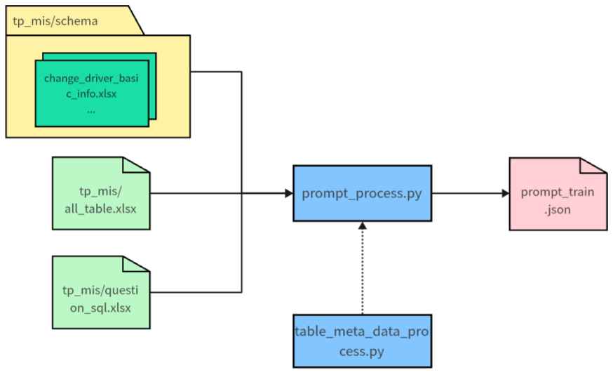
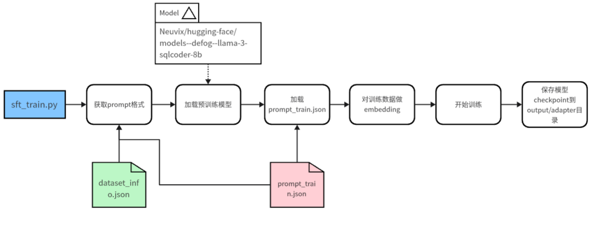

# Neuvix-NL2SQL项目

本项目基于DB-GBT-HuB框架，将重构<u>数据预处理、模型微调、模型推理（预测）</u>三部分功能。

#### 目前已重构文件夹：

| 文件夹名称   | 路径                   | 说明                                                         |
| ------------ | ---------------------- | ------------------------------------------------------------ |
| config       | dbgpt_hub/configs      | 保存配置参数的路径，例如data_source数据来源                  |
| data_process | dbgpt_hub/data_process | 数据预处理：1）解析数据库表结构；2）将sql-查询文本对转为prompt |
| dataset_util | dbgpt_hub/dataset_util | 连接数据库，无用，已删                                       |
| train        | dbgpt_hub/train        | 训练模型                                                     |
| predict      | dbgpt_hub/predict      | 根据查询推理sql，目前只使用dbgpt_hub/predict/predict_one_sql.py，预测单条sql |
| data         | dbgpt_hub/data         | 训练数据                                                     |
| llm_base     | dbgpt_hub/llm_base     | 加载模型                                                     |
| scripts      | dbgpt_hub/scripts      | 运行脚本                                                     |


#### 模型底座

hugging-face/models--defog--llama-3-sqlcoder-8b（支持中文）

所在路径：/root/Neuvix/hugging-face/models--defog--llama-3-sqlcoder-8b


## 0 环境准备、数据准备

0.1 环境准备

```
git clone https://github.com/Neuvix/DB-GPT-HUB.git
cd DB-GPT-HUB
conda create -n dbgpt_hub python=3.10 
conda activate dbgpt_hub
pip install poetry
poetry install # 一定要执行这步
```

0.2 数据准备（详情见Data_Preparation.md）

| 路径                                    | 结构      | 内容                                                         |
| --------------------------------------- | --------- | ------------------------------------------------------------ |
| dbgpt_hub/data/tp_mis/schema            | 文件夹    | 每个表的schema文件（英文列名、中文列名、主键），excel文件，格式见每个文件内容 |
| dbgpt_hub/data/tp_mis/all_table.xlsx    | excel文件 | 数据库所有表的中英文表名                                     |
| dbgpt_hub/data/tp_mis/question_sql.xlsx | excel文件 | sql-查询文本对，格式见文件内容                               |


## 1 数据预处理

#### 1.1 操作步骤

执行：

`poetry run sh dbgpt_hub/scripts/gen_train_eval_data.sh`

得到：

`dbgpt_hub/data/prompt_train.json`文件（用于训练）

#### 1.2 整体流程图：



#### 1.3 prompt_train.json文件

prompt文件是：dbgpt_hub\data\prompt_train.json

这个文件就是微调工程的输入数据（即给模型的提示词），格式如下：

```json
[
    {
        "db_id": "tp_mis",
        "table": "change_ship_archives_basic_info",
        "instruction": "I want you to act as a SQL terminal in front of an example database, you need only to return the sql command to me.Below is an instruction that describes a task, Write a response that appropriately completes the request.\n\"\n##Instruction:\ntp_mis contains tables such as change_ship_archives_basic_info. Table change_ship_archives_basic_info has columns such as id, ship_code, chi_and_eng_ship_name, nationality, ship_call_number, ship_imo_number, vessel_class, box_total, total_tonnage_of_ships, net_tonnage_of_ships, ships_deadweight_tonnage, ship_length, bow_position, chimney_position, ship_type_depth, ship_width, ship_height, ship_speed, date_of_construction, ship_type, Liner_identification, group_code, mmsi_code, bei_number, number_of_hatches, number_of_bow_shells, number_of_hatch_covers, empty_draft_tonnage, Heavy_load_draft_tonnage, number_of_deck_starting_layer, beihao_arrangement_order, slot_way, stowage_scheme, belonging_to_the_dock, create_date_time, del_flag, chi_ship_name, eng_ship_name. The comments of columns are 主键ID, 船舶代码, 中英文船名, 国籍, 船舶呼号, 船舶IMO号, 船舶等级？, 总箱量, 船舶总吨位, 船舶净吨位, 船舶载重吨, 船舶长度, 船头位置, 烟囱位置, 船舶型深, 船舶宽度, 船舶高度, 船舶速度, 建造日期, 船舶类型, 班轮标识, 集团代码, MMSI代码, 贝数量, 舱口数, 船头贝数, 舱盖数, 空载吃水吨位, 重载吃水吨位, 甲板起始层序号, 贝号排列顺序, slot_way?, stowage_scheme?, 所属码头, 记录创建时间, 删除标记。0-未删除；1-已删除, 中文船名, 英文船名. id is the primary key.\n\n",
        "input": "###Input:\n列出所有船舶的船舶代码\n\n###Response:",
        "output": "SELECT chi_and_eng_ship_name, ship_code FROM tp_mis.change_ship_archives_basic_info;",
        "history": []
    },
]
```

会包含数据库所有表的字段信息、输入的查询NL和sql。


## 2 模型微调（训练）

#### 2.1 步骤

配置（默认即可）：

dbgpt_hub/scripts/train_sft.sh文件：

```
model_name_or_path="/root/Neuvix/hugging-face/models--defog--llama-3-sqlcoder-8b"
output_dir="dbgpt_hub/output/adapter/llama-3-sqlcoder-lora"
```

执行：

`poetry run sh dbgpt_hub/scripts/train_sft.sh`

得到：

`DB-GPT-HUB/dbgpt_hub/output/adapter/llama-3-sqlcoder-lora`

#### 2.1 微调流程



